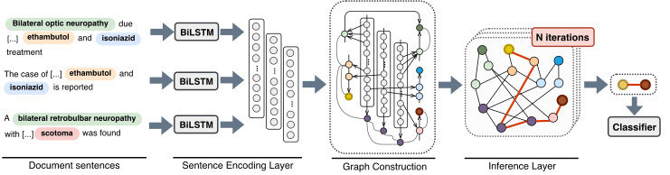

# Edge-oriented Graph
Source code for the EMNLP 2019 paper "[Connecting the Dots: Document-level Relation Extraction with Edge-oriented Graphs](https://www.aclweb.org/anthology/D19-1498.pdf)".

<p align="center">
  
</p>


### Environment
`$ pip3 install -r requirements.txt`  
The model was trained on Tesla K80 GPU, Ubuntu 16.04. Results are reproducible with a fixed seed.


### Reproducibility & Bug Fixes

In the original code, there was a bug related to the word embedding layer.  
If you want to reproduce the results presented in the paper, you need to use the "buggy" code: [reproduceEMNLP](https://github.com/fenchri/edge-oriented-graph/tree/reproduceEMNLP)   
Otherwise we recommend that you use the current version (with higher performance).


## Datasets & Pre-processing
Download the datasets
```
$ mkdir data && cd data
$ wget https://biocreative.bioinformatics.udel.edu/media/store/files/2016/CDR_Data.zip && unzip CDR_Data.zip && mv CDR_Data CDR
$ wget https://bitbucket.org/alexwuhkucs/gda-extraction/get/fd4a7409365e.zip && unzip fd4a7409365e.zip && mv alexwuhkucs-gda-extraction-fd4a7409365e GDA
$ cd ..
```

Download the GENIA Tagger and Sentence Splitter:
```
$ cd data_processing
$ mkdir common && cd common
$ wget http://www.nactem.ac.uk/y-matsu/geniass/geniass-1.00.tar.gz && tar xvzf geniass-1.00.tar.gz
$ cd geniass/ && make && cd ..
$ git clone https://github.com/bornabesic/genia-tagger-py.git
$ cd genia-tagger-py 
```
Here, you should modify the Makefile inside genia-tagger-py and replace line 3 with `wget http://www.nactem.ac.uk/GENIA/tagger/geniatagger-3.0.2.tar.gz`
```
$ make
$ cd ../../
```

> **Important**: In case genia splitter produces errors (e.g. cannot find a temp file), make sure you have ruby installed `sudo apt-get install ruby-full`

In order to process the datasets, they should first be transformed into the PubTator format. The run the processing scripts as follows:
```
$ sh process_cdr.sh
$ sh process_gda.sh
```

In order to get the data statistics run:
```
python3 statistics.py --data ../data/CDR/processed/train_filter.data
python3 statistics.py --data ../data/CDR/processed/dev_filter.data
python3 statistics.py --data ../data/CDR/processed/test_filter.data
```
This will additionally generate the gold-annotation file in the same folder with suffix `.gold`.


## Usage
Run the main script for training and testing as follows. Select gpu -1 for cpu mode.  

**CDR dataset**: Train the model on the training set and evaluate on the dev set, in order to identify the best training epoch.
For testing, re-run the model on the union of train and dev (`train+dev_filter.data`) until the best epoch and evaluate on the test set.

**GDA dataset**: Simply train the model on the training set and evaluate on the dev set. Test the saved model on the test set.

In order to ensure the usage of early stopping criterion, use the `--early_stop` option.
If during training early stopping is not triggered, the maximum epoch (specified in the config file) will be used.

Otherwise, if you want to train up to a specific epoch, use the `--epoch epochNumber` option without early stopping.
The maximum stopping epochs is defined by the `--epoch` option.

For example, in the CDR dataset:
```
$ cd src/
$ python3 eog.py --config ../configs/parameters_cdr.yaml --train --gpu 0 --early_stop       # using early stopping
$ python3 eog.py --config ../configs/parameters_cdr.yaml --train --gpu 0 --epoch 15         # train until the 15th epoch *without* early stopping
$ python3 eog.py --config ../configs/parameters_cdr.yaml --train --gpu 0 --epoch 15 --early_stop  # set both early stop and max epoch

$ python3 eog.py --config ../configs/parameters_cdr.yaml --test --gpu 0
```

All necessary parameters can be stored in the yaml files inside the configs directory.
The following parameters can be also directly given as follows:
```
usage: eog.py [-h] --config CONFIG [--train] [--test] [--gpu GPU]
              [--walks WALKS] [--window WINDOW] [--edges [EDGES [EDGES ...]]]
              [--types TYPES] [--context CONTEXT] [--dist DIST] [--example]
              [--seed SEED] [--early_stop] [--epoch EPOCH]

optional arguments:
  -h, --help            show this help message and exit
  --config CONFIG       Yaml parameter file
  --train               Training mode - model is saved
  --test                Testing mode - needs a model to load
  --gpu GPU             GPU number
  --walks WALKS         Number of walk iterations
  --window WINDOW       Window for training (empty processes the whole
                        document, 1 processes 1 sentence at a time, etc)
  --edges [EDGES [EDGES ...]]
                        Edge types
  --types TYPES         Include node types (Boolean)
  --context CONTEXT     Include MM context (Boolean)
  --dist DIST           Include distance (Boolean)
  --example             Show example
  --seed SEED           Fixed random seed number
  --early_stop          Use early stopping
  --epoch EPOCH         Maximum training epoch
```

### Evaluation
In order to evaluate you need to first generate the gold data format and then use the evaluation script as follows:
```
$ cd evaluation/
$ python3 evaluate.py --pred path_to_predictions_file --gold ../data/CDR/processed/test_filter.gold --label 1:CDR:2
$ python3 evaluate.py --pred path_to_predictions_file --gold ../data/GDA/processed/test.gold --label 1:GDA:2
```


### Citation

If you found this code useful and plan to use it, please cite the following paper =)
```
@inproceedings{christopoulou2019connecting,  
title = "Connecting the Dots: Document-level Neural Relation Extraction with Edge-oriented Graphs",  
author = "Christopoulou, Fenia and Miwa, Makoto and Ananiadou, Sophia",  
booktitle = "Proceedings of the 2019 Conference on Empirical Methods in Natural Language Processing and the 9th International Joint Conference on Natural Language Processing (EMNLP-IJCNLP)",  
year = "2019",  
publisher = "Association for Computational Linguistics",  
pages = "4927--4938"  
}  
```
